最後に、文字列集合としての論理演算の例を示しましょう。

ここまで述べませんでしたが、受理状態の有無などから、対象の文字列集合に要素が存在するかの確認ができます。これを、 `blank` メソッドとして定義しいます。
存在確認と、論理演算を組み合わせて 包含関係(`include`) や 一致(`__eq__`)
 も実装しています。

:::message
`include` は `(~self & other).blank()` で、`__eq__` は `self.include(other) and other.include(self)` で実装しています。
:::

例えば、 `(a+|ab)&!a` と `a(a+|b)` を考えます。
 
以下の通り、 **内部のDFAは異なります** (DFAの最適化は `spexm8p` では実施していません)。

<!-- ```mermaid:(a+|ab)&!a:exec cd submodules/spex-m8p-py/;python3 -c "from spexm8p.builder import spex;print(spex('(a+|ab)&!a').mermaid())" -->

#### (a+|ab)&!a

```mermaid
graph LR
    2( )
    3( )
    1( )
    4( )
    0(( ))
    5( )
    style 2 stroke:#dc3545,stroke-width:4px
    style 4 stroke:#dc3545,stroke-width:4px
    style 0 fill:#000,stroke-width:0px
    2 -- "a" --> 2
    2 -- "[^a]" --> 3
    3 -- "." --> 3
    1 -- "a" --> 2
    1 -- "b" --> 4
    1 -- "[^ab]" --> 3
    4 -- "." --> 3
    0 -- "a" --> 1
    0 -- "[^a]" --> 5
    5 -- "." --> 5


```



#### a(a+|b)

```mermaid
graph LR
    3( )
    4( )
    2( )
    1( )
    5( )
    0(( ))
    6( )
    style 3 stroke:#dc3545,stroke-width:4px
    style 2 stroke:#dc3545,stroke-width:4px
    style 5 stroke:#dc3545,stroke-width:4px
    style 0 fill:#000,stroke-width:0px
    3 -- "a" --> 3
    3 -- "[^a]" --> 4
    4 -- "." --> 4
    2 -- "a" --> 3
    2 -- "[^a]" --> 4
    1 -- "a" --> 2
    1 -- "b" --> 5
    1 -- "[^ab]" --> 4
    5 -- "." --> 4
    0 -- "a" --> 1
    0 -- "[^a]" --> 6
    6 -- "." --> 6


```

<!-- ```mermaid:a(a+|b):exec cd submodules/spex-m8p-py/;python3 -c "from spexm8p.builder import spex;print(spex('a(a+|b)').mermaid())" -->



しかしながら、`(a+|ab)&!a` と `a(a+|b)` の **対象となる文字列（要素）は一致** しています。
一致の判定に論理演算を用いているため、これらは正しく評価されます。

```console
# python3
Python 3.9.2 (default, Mar  4 2021, 15:30:45)
[GCC 8.3.0] on linux
Type "help", "copyright", "credits" or "license" for more information.
>>> from spexm8p.builder import spex
>>> spex('(a+|ab)&!a') == spex('a(a+|b)')
True
>>>
```

念のため、`(a+|ab)&!a` を `(a+|ab)` に変えると、一致しないことを確認しましょう。

```console
>>> spex('(a+|ab)') == spex('a(a+|b)')
False
>>>
```

一致はしませんが、包含関係は確認できます。

```console
>>> spex('(a+|ab)').include(spex('a(a+|b)'))
False
>>>
```

記号を使わなければ、通常の文字列は、そのままその文字列を表す正規表現となります。
そのため、通常の正規表現のマッチの確認も論理演算で確認する事も出来ます。

```console
>>> not (spex('[abc]+') & spex('ababca')).blank()
True
>>>
```

例えば、 `(abc)+` (abcの繰返し文字)  の 5文字目が a にマッチするか、 bにマッチするか等も確認ができます。

```console
>>> # 0文字以上の表現が無いので、少し強引な方法で確認
>>> not (spex('(abc)+') & spex('....a|....a.+')).blank()
False
>>> not (spex('(abc)+') & spex('....b|....b.+')).blank()
True
```

目的であった、論理演算可能な文字列集合の表現が実現を達成出来ていることが分かるでしょう。
