```mermaid
graph LR
    4( )
    5( )
    3( )
    7( )
    8( )
    6( )
    9( )
    2( )
    1( )
    10( )
    11( )
    0(( ))
    12( )
    style 6 stroke:#dc3545,stroke-width:4px
    style 1 stroke:#dc3545,stroke-width:4px
    style 10 stroke:#dc3545,stroke-width:4px
    style 11 stroke:#dc3545,stroke-width:4px
    style 0 fill:#000,stroke-width:0px
    4 -- "a" --> 3
    4 -- "[^a]" --> 5
    5 -- "." --> 5
    3 -- "c" --> 4
    3 -- "b" --> 6
    3 -- "[^bc]" --> 8
    7 -- "[bc]" --> 6
    7 -- "[^bc]" --> 8
    8 -- "." --> 8
    6 -- "a" --> 7
    6 -- "[^a]" --> 9
    9 -- "." --> 9
    2 -- "a" --> 3
    2 -- "[^a]" --> 5
    1 -- "c" --> 2
    1 -- "b" --> 10
    1 -- "a" --> 11
    1 -- "[^abc]" --> 8
    10 -- "a" --> 7
    10 -- "[^a]" --> 9
    11 -- "a" --> 11
    11 -- "[^a]" --> 8
    0 -- "a" --> 1
    0 -- "[^a]" --> 12
    12 -- "." --> 12


```

それでは、各種のDFA変換結果を確認しましょう。

:::message
本書で示すDFAの図は、Spexクラスのmermaid()メソッドでの出力結果を、コードブロックの言語名に`mermaid`を指定して表示しています。
Zennのダイアグラム表示については、 [ZennのMarkdown記法一覧](https://zenn.dev/zenn/articles/markdown-guide#%E3%83%80%E3%82%A4%E3%82%A2%E3%82%B0%E3%83%A9%E3%83%A0) を参照してください。
:::

## 'a' [単一文字]

``` python
from spexm8p.builder import spex
print(spex('a').mermaid())
```

<!-- ```mermaid:a:exec cd submodules/spex-m8p-py/;python3 -c "from spexm8p.builder import spex;print(spex('a').mermaid())" -->




```mermaid
graph LR
    0(( ))
    1( )
    2( )
    style 0 fill:#000,stroke-width:0px
    style 1 stroke:#dc3545,stroke-width:4px
    0 -- "a" --> 1
    0 -- "[^a]" --> 2
    1 -- "." --> 2
    2 -- "." --> 2
```

## '!a' [否定(補集合)]

``` python
from spexm8p.builder import spex
print(spex('!a').mermaid())
```

<!-- ```mermaid:!a:exec cd submodules/spex-m8p-py/;python3 -c "from spexm8p.builder import spex;print(spex('!a').mermaid())" -->




```mermaid
graph LR
    0(( ))
    1( )
    2( )
    style 0 fill:#000,stroke-width:0px
    style 2 stroke:#dc3545,stroke-width:4px
    0 -- "a" --> 1
    0 -- "[^a]" --> 2
    1 -- "." --> 2
    2 -- "." --> 2


```

## 'ab' [連結]

``` python
from spexm8p.builder import spex
print(spex('ab').mermaid())
```

<!-- ```mermaid:ab:exec cd submodules/spex-m8p-py/;python3 -c "from spexm8p.builder import spex;print(spex('ab').mermaid())" -->




```mermaid
graph LR
    3( )
    2( )
    1( )
    0(( ))
    4( )
    style 2 stroke:#dc3545,stroke-width:4px
    style 0 fill:#000,stroke-width:0px
    3 -- "." --> 3
    2 -- "." --> 3
    1 -- "b" --> 2
    1 -- "[^b]" --> 3
    0 -- "a" --> 1
    0 -- "[^a]" --> 4
    4 -- "." --> 4


```

## 'a+' [繰返し]

``` python
from spexm8p.builder import spex
print(spex('a+').mermaid())
```

<!-- ```mermaid:a+:exec cd submodules/spex-m8p-py/;python3 -c "from spexm8p.builder import spex;print(spex('a+').mermaid())" -->




```mermaid
graph LR
    2( )
    3( )
    1( )
    0(( ))
    style 2 stroke:#dc3545,stroke-width:4px
    style 1 stroke:#dc3545,stroke-width:4px
    style 0 fill:#000,stroke-width:0px
    2 -- "a" --> 2
    2 -- "[^a]" --> 3
    3 -- "." --> 3
    1 -- "a" --> 2
    1 -- "[^a]" --> 3
    0 -- "a" --> 1
    0 -- "[^a]" --> 3


```

## '[ab]|[bc]' [論理和(和集合)]

``` python
from spexm8p.builder import spex
print(spex('[ab]|[bc]').mermaid())
```

<!-- ```mermaid:[ab]|[bc]:exec cd submodules/spex-m8p-py/;python3 -c "from spexm8p.builder import spex;print(spex('[ab]|[bc]').mermaid())" -->



```mermaid
graph LR
    2( )
    1( )
    0(( ))
    3( )
    4( )
    style 1 stroke:#dc3545,stroke-width:4px
    style 0 fill:#000,stroke-width:0px
    style 3 stroke:#dc3545,stroke-width:4px
    style 4 stroke:#dc3545,stroke-width:4px
    2 -- "." --> 2
    1 -- "." --> 2
    0 -- "b" --> 1
    0 -- "a" --> 3
    0 -- "c" --> 4
    0 -- "[^abc]" --> 2
    3 -- "." --> 2
    4 -- "." --> 2


```

## '[ab]&[bc]' [論理積(積集合)]

``` python
from spexm8p.builder import spex
print(spex('[ab]&[bc]').mermaid())
```

<!-- ```mermaid:[ab]&[bc]:exec cd submodules/spex-m8p-py/;python3 -c "from spexm8p.builder import spex;print(spex('[ab]&[bc]').mermaid())" -->




```mermaid
graph LR
    2( )
    1( )
    0(( ))
    3( )
    4( )
    style 1 stroke:#dc3545,stroke-width:4px
    style 0 fill:#000,stroke-width:0px
    2 -- "." --> 2
    1 -- "." --> 2
    0 -- "b" --> 1
    0 -- "a" --> 3
    0 -- "c" --> 4
    0 -- "[^abc]" --> 2
    3 -- "." --> 2
    4 -- "." --> 2


```

## '((a[bc])+&!((ac)+))|a+' [グループ化含む]

``` python
from spexm8p.builder import spex
print(spex('((a[bc])+&!((ac)+))|a+').mermaid())
```

<!-- ```mermaid:((a[bc])+&!((ac)+))|a+:exec cd submodules/spex-m8p-py/;python3 -c "from spexm8p.builder import spex;print(spex('((a[bc])+&!((ac)+))|a+').mermaid())" -->



